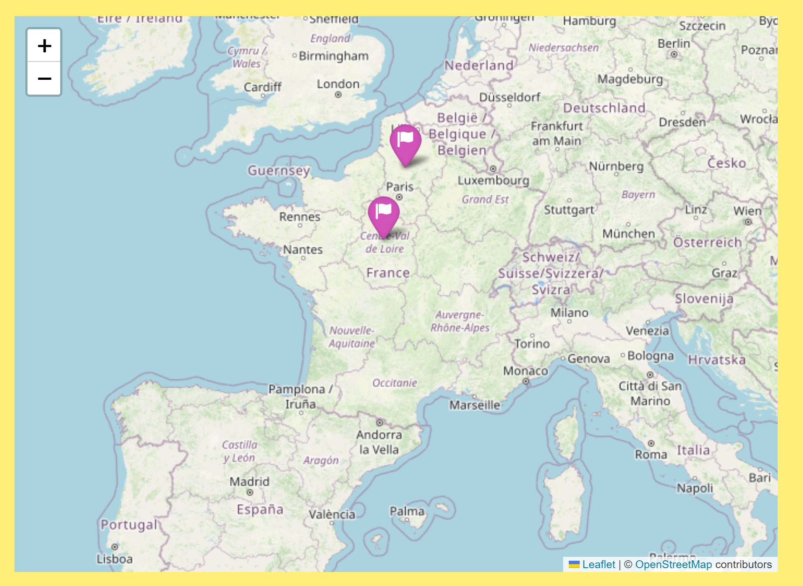
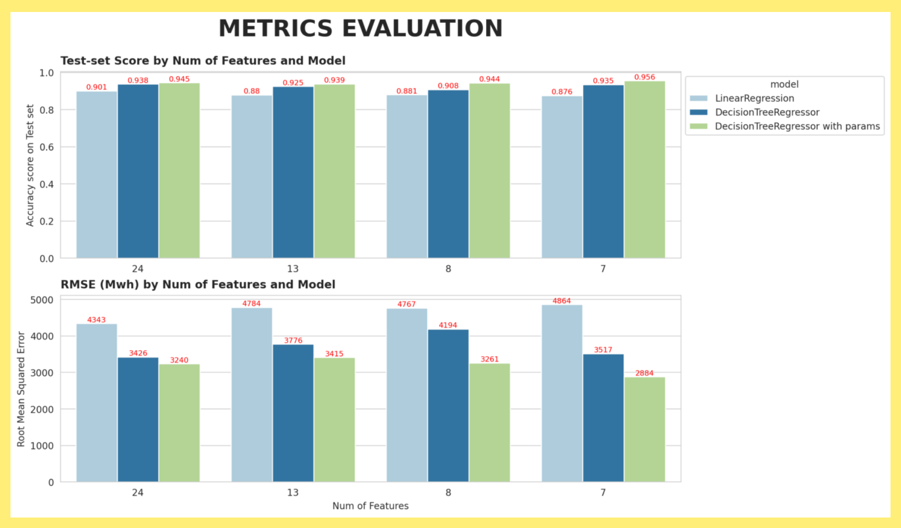

# Regional Electricity Consumption Prediction System
#### The last project implemented in the Intensive Course for Data Analyst at Wild Code School (Regression Model)
#### A project focusing primarily on the analysis of model evaluation.
#### by Mai Tran

## Summary of the Project

As part of my training at Wild Code School, with the very enthusiastic support from my coach, Mathieu Procis, I implented this project which is about the electricity consumption and how weather affects it in 2 specific region of France: Centre-Val de Loire and Hauts-de-France. In this project, I just worked on a small part of Enedis's dataset which has the power allows up to 36Kwh.

(Location of two regions in this project)

Special thanks to opendata of enedis.fr and historique-meteo.net, we could collect and exploit these datasets for our learning and training practice.

Requirement for the final product is a regional electricity consumption prediction system in general terms, which returns user's amount of regional electricity consumption per day when user inputs certain important weather indicators. At the beginning, I used all the weather features to explain our target variable (electricity consumption), then I tried to reduire them until the ideal numbers to achive a highe enough score while using minimum number components of features. In the framework of this project, I don't need to pay attention to the accuracy of the predicted result, but it is important to explain the selection of features for the model.

After the first model using DecisionTreeRegressor, I also trained another one requiring more detail in the sense of separating the user's profile. I will ask user to input more information as contract's registration power range, season,... to return a more individual prediction to user. Despite I can not get high score due to information missing but I tried to explore a little bit to understand the importance of some feature that I ignored in our global models.

## About the dataset

- 2 datasets about total electricity consumption every half hour of 2 regions from 4/2022 to 3/2024, which provides me condensed and macro information of the regional electricity consumption.
  
  
- 33 datasets about the weather indicators of 11 departments in 2 regions.
  

## Explaining step by step
Step 1: Extract data from mentioned sources.

Step 2: Combine and Explorate (Analyze) all the datasets.

Step 3: Clean and feature data in order to prepare for ML.

Step 4: Train and evaluate models (standardize, PCA, RandomSearchCV,...).

Step 5: Create Streamlit App for visualization of final product.

## Model evaluation analysis
This session is to explain our ML workflow and how did I filter all the variables to obtain the last product.
- Overview of main dataset:
    1462 rows equivalent to 365 days x 2 years x 2 regions
    Target variable: 'total_consum_Mwh'
    Explanatory variables are all the columns except of 'DATE' and target column
  
- ML Pipline:
  

- Machine Learning workflow step by step:
  0. Extract and preprocess data
  1. Initialze X (explanatory variables), y (target variable)
  2. Split train, test then standardize X_train, X_test
  3. Train 2 models: LR, DTR and evaluate models using merics score on test/train set, RMSE
  4. Apply PCA to reduce not very important demensions (explanatory variables)
  5. Get columns names of important components then train models again with new numbers of explanatory variables
  6. Apply RandommizedSearchCV to get good hyperparameters for model DTR. Then, train DTR again tuning hyperparameters
  7. Final evaluation: vizualize test-score and RMSE on bar chart to compare and choose final model
 
- Conclusion:
  After using PCA to obtain the most important features according to theirs variance contribution in the dataset, I got 8 variables: ['region_code', 'season', 'snow', 'humidity', 'PRESSURE_MAX_MB', 'wind_speed', total_precip', 'max_tem'] as input for my   DecisionTreeRegressor model. But according to our analysis, I observed that 'wind_speed' and 'PRESSURE_MAX_MB' don't have much influence on electricity consumption of regions, so I tried to replace them by a time variable 'hol_weekend_vac' to see what could happen. The results that I got were very interesting. I visualized all the results (test-score and RMSE) into a barplot for easier observing.

  Thus, in the end, we selected 7 variables as input, they are:['region_code', 'season', 'hol_weekend_vac', 'humidity', 'snow', 'max_tem', 'total_precip']

  

## Visit the application on Streamlit

